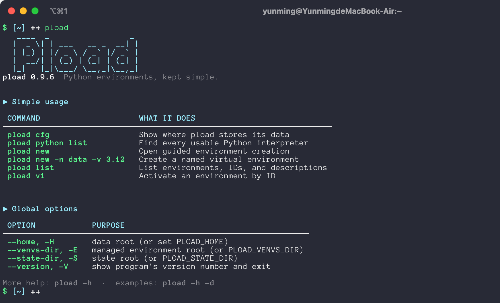
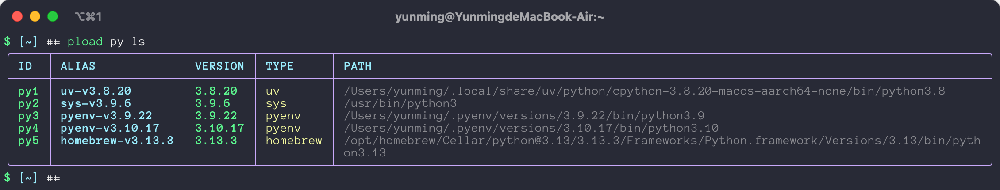
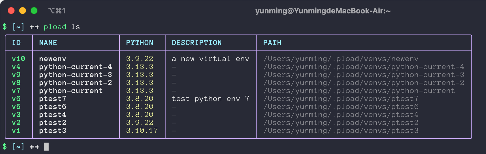
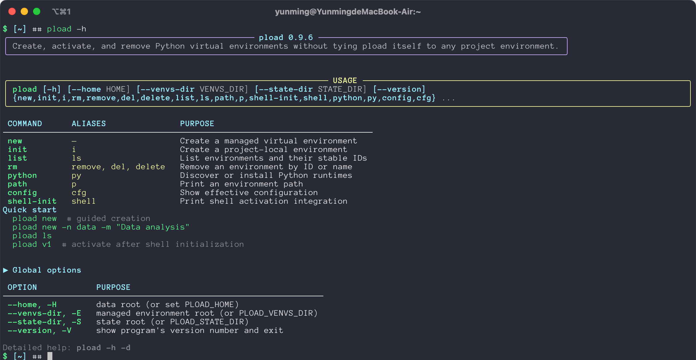

# pload



`pload` is a relocatable Python runtime and virtual-environment manager for
Bash, Zsh, Fish, and PowerShell. Its private runtime, downloaded Python
versions, virtual environments, registry, and caches can all live under
directories you choose. pyenv is supported for discovery, but is not required.

Running `pload` without arguments opens a small welcome screen. Use `-h` for a
complete parameter reference and `-h -d` for practical examples and effects.

## Contents

- [Install](#install)
- [Upgrade](#upgrade)
- [First run](#first-run)
- [Configure later](#configure-later)
- [Shell activation](#shell-activation)
- [Discover and install Python](#discover-and-install-python)
- [Create and activate environments](#create-and-activate-environments)
- [Reproduce and share environments](#reproduce-and-share-environments)
- [Help and aliases](#help-and-aliases)
- [Isolation and directory layout](#isolation-and-directory-layout)
- [Command reference](#command-reference)
- [Development](#development)

## Install

Install the small bootstrap package, then start the guided installer:

```console
python -m pip install --user --upgrade pload
python -m pload.installer
```

If your distribution enforces PEP 668, use pipx or a dedicated bootstrap
virtual environment:

```console
python3 -m venv ~/.pload-bootstrap
~/.pload-bootstrap/bin/python -m pip install --upgrade pload
~/.pload-bootstrap/bin/python -m pload.installer
```

On Windows, replace `python` with `py` when appropriate. If pipx is already
available:

```console
pipx install pload
pload-install
```

The installer uses colored numbered choices for the pload data directory,
launcher directory, virtual-environment directory, Python directory, runtime
source, pip index, and optional shell integration. Press Enter to accept a
marked default.

After installation it prints an ASCII welcome screen with copyable next steps.
The same screen is shown whenever you run bare `pload` (see the screenshot at
the top of this page).

For a non-interactive setup:

```console
python -m pload.installer --yes \
  --home /mnt/tools/pload \
  --bin-dir ~/.local/bin \
  --venvs-dir /mnt/venvs \
  --python-dir /mnt/python \
  --source ustc \
  --pip-source tsinghua
```

`--yes` accepts explicit values and saved defaults. It only changes a shell
profile when `--shell` is supplied or already configured.

## Reproduce and share environments

This feature combines environment recipes, checked wheel backups, cache reuse,
remote repositories and an explainable per-package reproduction planner. See the
full [reproducibility and artifact reuse guide](docs/reproducibility.md) for the
guarantee levels, selection algorithm, CUDA-package example and current boundaries.

The next-version experiment on `experiment/reproduction-planner` adds
`export`, `plan`, `restore` and `repo`. These commands are not in the published 1.0.0.
Install this checkout into a separate development environment to try them:

```console
python3 -m venv .dev
.dev/bin/python -m pip install -e .
.dev/bin/pload export -h -d
```

On Windows, use `.dev\Scripts\python.exe` and `.dev\Scripts\pload.exe`.
If using a shell function installed by 1.0.0, call the new executable directly
or refresh shell integration so it recognizes the new commands.

### Save a recipe or a wheel bundle

```console
pload export analysis-01 -e v1
pload export analysis-offline -e v1 -b all
pload export training-01 -e v2 -b torch -f /mnt/existing-wheels
```

Each snapshot is an immutable directory under `PLOAD_HOME/snapshots/NAME`.
`requirements.txt` contains exact installed package versions, and `snapshot.json`
records Python, platform, architecture, libc information and SHA-256 checksums.
`-b all` adds all application package wheels; `-b torch,torchvision` archives only
those packages. Other pinned packages are fetched from the configured index on restore.
For a CUDA wheel index, add `-i https://download.pytorch.org/whl/cuXXX`, replacing
`cuXXX` with the index appropriate for the installed torch build. The supplied
index is recorded without credentials or query parameters; it is not automatically
trusted or selected on restore. Use `restore -i URL` when needed.

For environments created by venv, virtualenv, uv, Poetry or Pipenv, pass their
Python executable directly (it must support Python 3.8+):

```console
pload export other-project -p /path/to/project/.venv/bin/python
pload restore other-project -n project-copy
pload restore ./requirements.txt -n imported -v 3.12
python -m pip install -r ~/.pload/snapshots/analysis-01/requirements.txt
```

Requirements exported by another tool are the interchange format. Native uv,
Poetry and Pipenv lockfiles are not parsed: export a requirements file with the
original tool first. A snapshot describes what is installed; it is not a
cross-platform solver lockfile. pip/setuptools/wheel bootstrap tooling is excluded.
Archiving wheels requires pip inside the source environment; an existing uv can
seed it, for example `uv pip install --python /path/to/.venv/bin/python pip`.

Editable installs and source checkouts must first be built and installed as wheels.
For direct-URL or local-wheel installs, supply the original wheel via `-f DIR`
and include the package in `-b`; its SHA-256 must match the installation metadata.
Environments restored from a bundle can be re-exported with `-b all`, reusing
those exact wheels from the shared cache.
Native Conda environments are also rejected: their native libraries/channels cannot
be reproduced by pip. Keep a native Conda export, or explicitly export only pip
requirements when a pip-only conversion is intended.

### Restore and understand the limits

```console
pload restore analysis-offline -n analysis-copy -o
pload restore analysis-01 -n another-platform -p
```

By default Python major/minor, implementation, OS and architecture must match.
`-o` requires a complete `-b all` bundle and installs without an index; wheels are
verified before use and pip checks their supported platform tags. The Python
interpreter must already be installed. `-p` explicitly permits another platform
and re-resolves the pins without the bundled wheels. This can fail when that
version has no compatible build; it cannot be combined with `-o`.

NumPy is platform-dependent too. Wheels cannot restore kernel drivers, the CUDA
driver, system libraries, compiler flags, environment variables, data files or
Conda native dependencies. OS/architecture checks are only a first guard, not a
complete ABI or GPU compatibility guarantee. The first version does not mount
remote site-packages at runtime: it fetches reusable artifacts and installs locally.
Checksums detect corruption, not a malicious repository owner. Restore only trusted
packages/requirements; installation can execute code. If installation fails, the
new environment remains for inspection; existing environments are not modified.

### Use your own host, a directory or GitHub

```console
pload repo add lab frpxiaoxin:/home/tibless/pload-cloud -t ssh
pload repo push lab analysis-offline
# On another machine, configure the same remote first:
pload repo pull lab analysis-offline
pload restore analysis-offline -n analysis-copy -o

pload repo add disk /mnt/shared/pload -t local
pload repo add recipes git@github.com:YOUR-NAME/pload-recipes.git -t git
pload repo push recipes analysis-01
pload repo list
pload repo remove lab
```

SSH uses your existing alias/keys and `ssh`/`scp`, with a Linux filesystem on the
server; no daemon, public HTTP endpoint or new Python dependency is needed. An
SSH alias is preferable to a hardcoded FRP IP/port because SSH already manages
the connection details. Git uses your installed Git and its authentication/identity.
Create the GitHub repository yourself and point `repo add` at its URL. Git stores
recipes only; push large wheel bundles to SSH or a local filesystem instead.
Git pushes a new snapshot commit to the repository's default branch. Pull never
installs packages automatically. Removing a remote removes only its configuration.

Snapshot names cannot be overwritten locally or remotely: choose a new name for
each revision. Failed SSH uploads can leave `.upload-*` staging directories, which
are not visible as published snapshots. This initial version does not provide
remote garbage collection, interrupted-download resumption or a remote catalogue.

### Reuse downloads

`PLOAD_HOME/cache/wheels` is shared by export, restore and package installation
during `pload new`. Export/restore attempt an offline wheel lookup first, then use
pip's normal resolver and cache. `export -f DIR` can reuse existing wheel files;
it is repeatable. Pulled wheels are checksum-checked and added to the shared cache.
Identical filenames with different bytes are rejected rather than silently replaced.
SSH stores identical wheel content once under `objects/SHA256`, with hard links
from snapshots. Pull skips network transfer for identical local cached wheels.

pip's existing HTTP/wheel cache is left in its configured location and remains
usable. Set `PIP_CACHE_DIR=/your/path` to relocate it; set `PLOAD_HOME` to relocate
pload's snapshot and shared wheel directories. Unpacked uv caches or installed
site-packages are not treated as wheel archives. A cache miss may still require
one download even when the library is already installed somewhere.

## Upgrade

Check the installed version first:

```console
pload --version
```

For an installation managed by `pload-install`, upgrade the private runtime
in place. Your configured directories, registry, downloaded Python runtimes,
and virtual environments are kept:

```console
pload-install --yes --package-spec "pload==1.0.0"
```

To always follow the newest published release instead of pinning a version,
omit the version constraint:

```console
pload-install --yes --package-spec pload
```

If your selected mirror has not synchronized the release yet, choose the
official index for this run (or replace it with another configured index):

```console
pload-install --yes --package-spec "pload==1.0.0" --pip-index https://pypi.org/simple
```

For pipx installations use pipx's own upgrade command:

```console
pipx upgrade pload
```

For a dedicated bootstrap virtual environment, run pip through that same
interpreter:

```console
~/.pload-bootstrap/bin/python -m pip install --upgrade pload
```

Verify the result and refresh shell integration if the current shell still
has an older function loaded:

```console
pload --version
pload cfg
eval "$(pload shell-init zsh)"   # use bash/fish/powershell as appropriate
```

On systems enforcing PEP 668, do not force-install into the system Python;
use pipx or the dedicated bootstrap environment shown above.

## First run

```console
pload
```

The no-argument screen gives the shortest useful tour:

```console
pload cfg                         # show effective paths and sources
pload python list                 # discover usable Python interpreters
pload new -n data -v 3.12         # create an environment
pload list                        # list IDs, descriptions, and paths
pload v1                          # activate an environment by ID
```

Run `pload new` without options to start the guided creator. It lists detected
Python runtimes, then asks for the interpreter, environment name, description,
and optional packages. Press Enter to accept the suggested value at each step.

## Configure later

Inspect the effective configuration:

```console
pload cfg
pload config show
```

Change one value without reinstalling pload or uv:

```console
pload cfg set source ustc
pload cfg set pip-source tsinghua
pload cfg set venvs-dir ~/venvs
pload cfg set python-dir ~/.pload/pythons
pload cfg set shell zsh
```

Reopen the complete setup wizard at any time:

```console
pload cfg -t
```

The wizard reuses current values as defaults and updates configuration plus the
selected shell profile. It does not reinstall pload, uv, or existing
environments. Configuration is stored in `PLOAD_HOME/config.json`.

## Shell activation

The installer can update a shell profile. To configure it manually:

```bash
# Bash
eval "$(pload shell-init bash)"

# Zsh
eval "$(pload shell-init zsh)"

# Fish
pload shell-init fish | source
```

PowerShell:

```powershell
Invoke-Expression (& pload shell-init powershell | Out-String)
```

Then `pload v1`, `pload data`, and `pload .` can activate environments in the
current shell.

## Discover and install Python

`pload python list` scans usable interpreters from the operating system, PATH,
uv, pyenv, Conda, mise, asdf, Homebrew, and the Windows Python Launcher.
Duplicate executable paths are collapsed:

```console
pload python list
pload python list --filter uv,conda
pload python list --filter uv conda
pload python path 3.12
```

Each distinct executable receives a stable Python ID and readable alias:

```text
ID   ALIAS          VERSION  TYPE    PATH
py1  uv-v3.12.8     3.12.8   uv      ~/.pload/pythons/.../python3.12
py2  conda-v3.11.9  3.11.9   conda   ~/miniforge3/envs/data/bin/python
```

The ID and alias are separate columns in the real output:



Use any of these forms when selecting an interpreter:

```console
pload new -n data --version py1
pload new -n data --version uv-v3.12.8
pload new -n data --version py1:uv-v3.12.8
pload python path py1
```

Types include `sys`, `pyenv`, `uv`, `conda`, `mise`, `asdf`, `homebrew`, and
`other`. Compatibility names `system` and `managed` map to `sys` and `uv`.

Install a managed Python without pyenv:

```console
pload python install 3.12
pload python install 3.13.3
```

Managed runtimes are stored under the configured Python directory and do not
replace `/usr/bin/python`, Homebrew, pyenv, or Conda installations.

Runtime downloads and Python package downloads are configured separately:

- runtime source: `official`, `ustc`, or `custom`;
- pip source: `official`, `tsinghua`, `ustc`, `aliyun`, or `custom`.

The runtime source controls uv's `python-build-standalone` archives. A normal
PyPI mirror does not host those archives.

## Create and activate environments

Create a named environment with a description:

```console
pload new                     # guided creation
pload new -n data -v 3.12 -m "Data analysis"
pload new -n web -v 3.12 -r fastapi uvicorn -m "Web API"
pload new -v 3.12 --message "Temporary data tools"  # auto-named safely
pload list
pload v1
```

Create a project-local environment:

```console
pload init -m "Current project"
pload .
pload init -r pytest requests
```

Use an explicit interpreter or destination when needed:

```console
pload new -p /mnt/venvs/build -v /opt/python/bin/python
pload init -P /mnt/projects/app -e /mnt/venvs/app
```

Every managed environment receives an ID such as `v1`, `v2`, or `v3`, plus a
description and creation timestamp. Deleted IDs are reused from the first
available number. `pload list` displays environments newest-first:



The table includes ID, name, Python version, description, and full path. A
spinner is shown in interactive terminals; redirected and CI output uses stable
ordinary log lines.

## Help and aliases

Brief help is a complete reference. It starts with an emphasized `USAGE` panel,
then lists every positional argument, long option, short alias, and description:

```console
pload config -h
pload cfg -h
pload new -h
pload py install -h
pload py ls -h
pload-install -h
```

The root help keeps global storage options together, while command-specific
help shows only that command's arguments:



Detailed help adds examples, expected output, disk effects, and failure behavior:

```console
pload -h -d
pload new -h -d
pload cfg -h -d
pload py ls -h -d
pload-install -h -d
```

Command aliases:

| Command | Alias |
| --- | --- |
| `new` | none; already short and explicit |
| `init` | `i` |
| `list` | `ls` |
| `rm` | `remove`, `del`, `delete` |
| `python` | `py` |
| `path` | `p` |
| `config` | `cfg` |
| `shell-init` | `shell` |

Python subcommands use `ls` and `p`; the explicit `install` command has no alias:

```console
pload py ls --filter uv,conda
pload python install 3.12
pload py p 3.12
```

## Isolation and directory layout

Put all pload-managed data under one root:

```console
export PLOAD_HOME=/mnt/workspace/.pload
pload new -n tools
```

The default layout is:

```text
PLOAD_HOME/
├── config.json       saved choices
├── runtime/          pload and uv private runtime
├── pythons/          downloaded Python runtimes
├── python-bin/       managed Python executable links
├── cache/python/     Python download cache
├── state/            environment IDs and Python runtime IDs
└── venvs/            managed virtual environments
```

Override individual roots with `PLOAD_VENVS_DIR`, `PLOAD_STATE_DIR`, or the
global `--home`, `--venvs-dir`, and `--state-dir` options. Project-local
environments can live elsewhere with `init --project-dir` and `--venv-dir`.

## Command reference

```console
pload new -h -d
pload init -h -d
pload list -h -d
pload rm -h -d
pload path -h -d
pload python -h -d
pload python install -h -d
pload python list -h -d
pload config -h -d
pload-install -h -d
```

Other useful commands:

```console
pload path v1
pload rm v1 --yes
pload rm --expression '^test-' --yes
pload cfg set source ustc
pload cfg -t
```

## Development

```console
python -m pip install -e '.[test]'
pytest
ruff check src tests
```

## License

Apache License 2.0. Copyright 2025 Yunming Hu.
